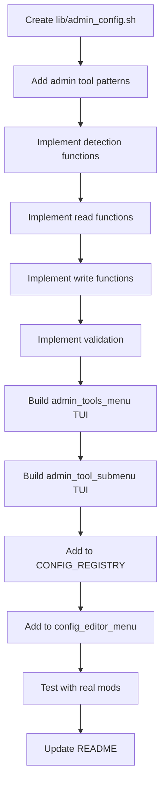

# Implementation Plan: Admin Tools Feature

## 1) Overview

**Title:** Admin Tools Menu  
**Scope:** New main menu entry "Admin Tools" below "Mod Configs" for managing admin permissions  
**Objective:** Unified interface to add/remove Steam64 IDs and passwords for all detected admin mods  
**Why:** Critical first-step configuration for any server, currently requires manual editing of multiple scattered files

---

## 2) Research Findings

### Admin Tools & Exact File Structures

#### 1. VPPAdminTools (Most Popular)
**Workshop ID:** `1708571078`

| File | Location | Format |
|------|----------|--------|
| SuperAdmins | `profile/VPPAdminTools/Permissions/SuperAdmins/SuperAdmins.txt` | Plain text |
| Password | `profile/VPPAdminTools/Permissions/credentials.txt` | Plain text |

**SuperAdmins.txt format:**
```
76561198012345678
76561198098765432
```
*One Steam64 ID per line, no spaces, no quotes, no symbols.*

**credentials.txt format:**
```
MySecretAdminPassword
```
*Password on first line only. Remove default text before adding password.*

---

#### 2. Community Online Tools (COT)
**Workshop ID:** `1564026768`

| File | Location | Format |
|------|----------|--------|
| Player Permissions | `profile/PermissionsFramework/Players/<Steam64ID>.json` | JSON |
| Roles | `profile/PermissionsFramework/Roles/*.json` | JSON |

**Player JSON format (e.g., `76561198012345678.json`):**
```json
{
    "PlayerData": {
        "SteamID64": "76561198012345678",
        "SteamName": "PlayerName"
    },
    "RoleName": "Admin"
}
```

**Alternative format (version varies):**
```json
{
    "Steam64ID": "76561198012345678",
    "Permissions": [],
    "Roles": ["Admin"]
}
```

> [!NOTE]
> COT is more complex. The player must join the server once to create their file (with "everyone" role), THEN we modify it to "Admin". Alternatively, we can pre-create the JSON.

---

#### 3. ZomBerry Admin Tools
**Workshop ID:** `2369477168`

| File | Location | Format |
|------|----------|--------|
| Admin List | `profile/Zomberry/admins.cfg` | Plain text |

**admins.cfg format:**
```
76561198012345678
76561198098765432
```
*One Steam64 ID per line, same as VPP SuperAdmins.txt*

---

#### 4. DayZ Expansion
**Workshop ID:** `2116151222` (Expansion Core)

| File | Location | Format |
|------|----------|--------|
| Admin Settings | `profile/ExpansionMod/Settings/PermissionsSettings.json` | JSON |

**PermissionsSettings.json format:**
```json
{
  "EnablePermissions": 1,
  "Admins": [
    "76561198012345678",
    "76561198098765432"
  ]
}
```

---

#### 5. Base DayZ Server (serverDZ.cfg)
**Location:** `data/config/serverDZ.cfg`

```cfg
passwordAdmin = "MyAdminPassword";
```
*Enables in-game admin commands via `#login MyAdminPassword` in chat.*

---

#### 6. BattlEye RCON (BEServer_x64.cfg)
**Location:** `data/config/BEServer_x64.cfg`

```cfg
RConPassword MyRCONPassword
RConPort 2302
```
*For remote RCON tools like CFTools, BattleMetrics.*

---

### Steam64 ID Validation

Format: 17-digit number starting with `7656119`

```bash
validate_steam64() {
    [[ "$1" =~ ^7656119[0-9]{10}$ ]]
}
```

---

## 3) Menu Structure

```
Main Menu
├── ...
├── 📁 Mod Configs
├── 🔐 Admin Tools              <- NEW
│   ├── Set Admin Password(s)   <- Entry point
│   │   └── [Detected Tools List]
│   │       ├── ✓ VPPAdminTools (installed)
│   │       ├── ✓ Community Online Tools (installed)
│   │       ├── ○ ZomBerry (not installed)
│   │       ├── ━━━━━━━━━━━
│   │       ├── DayZ Admin Password (serverDZ.cfg)
│   │       └── RCON Password (BEServer_x64.cfg)
```

---

## 4) Admin Tool Detection Logic

Check if mod is installed by looking for the mod ID in `mods.txt` + `servermods.txt`:

```bash
ADMIN_TOOLS=(
    "1708571078|VPPAdminTools|VPPAdminTools/Permissions/SuperAdmins/SuperAdmins.txt|text"
    "1564026768|Community Online Tools|PermissionsFramework/Players|json_dir"
    "2369477168|ZomBerry|Zomberry/admins.cfg|text"
    "2116151222|DayZ Expansion|ExpansionMod/Settings/PermissionsSettings.json|json"
)
```

For each tool:
1. Check if mod ID exists in mods.txt/servermods.txt (enabled)
2. Check if config folder/file exists in profile directory
3. Show status: ✓ configured | ⚠ not configured | ○ not installed

---

## 5) Proposed Implementation

### New File: `lib/admin_config.sh`

#### Core Functions

```bash
# Detection
detect_admin_tools()           # Returns JSON array of detected tools
is_admin_tool_installed()      # Check mods.txt for tool ID
get_admin_tool_status()        # Check if config exists & has admins

# Read Operations
get_vpp_admins()               # Read SuperAdmins.txt
get_vpp_password()             # Read credentials.txt
get_cot_admins()               # List Player JSON files marked as Admin
get_zomberry_admins()          # Read admins.cfg
get_expansion_admins()         # Read PermissionsSettings.json
get_dayz_admin_password()      # Read serverDZ.cfg passwordAdmin
get_rcon_password()            # Read BEServer_x64.cfg

# Write Operations
add_vpp_admin()                # Append to SuperAdmins.txt
remove_vpp_admin()             # Remove line from SuperAdmins.txt
set_vpp_password()             # Write credentials.txt
add_cot_admin()                # Create/update player JSON
remove_cot_admin()             # Delete/update player JSON
add_zomberry_admin()           # Append to admins.cfg
remove_zomberry_admin()        # Remove line from admins.cfg
add_expansion_admin()          # Update JSON array
remove_expansion_admin()       # Update JSON array
set_dayz_admin_password()      # Update serverDZ.cfg
set_rcon_password()            # Update BEServer_x64.cfg

# Validation
validate_steam64()             # Regex check for 17-digit Steam64 ID

# TUI
admin_tools_menu()             # Main menu entry
admin_tool_submenu()           # Per-tool management
add_admin_prompt()             # Input dialog for Steam64 ID
```

---

## 6) Implementation Steps



### Detailed Steps

1. **Create `lib/admin_config.sh`** with header and tool patterns
2. **Detection:** Check mods.txt for installed admin tools
3. **Read/Write per format:**
   - Text format (VPP, ZomBerry): Simple line-based append/remove
   - JSON format (COT, Expansion): Python one-liners for safe JSON manipulation
4. **TUI:** Main menu shows tools with status icons, sub-menu handles add/remove/password
5. **Integration:** Add "Admin Tools" to `CONFIG_REGISTRY` and handle in `config_editor_menu`

---

## 7) Files to Modify

| File | Change |
|------|--------|
| [NEW] `lib/admin_config.sh` | All admin tool logic and TUI |
| [MODIFY] `lib/config.sh` | Add "adminTools" to CONFIG_REGISTRY |
| [MODIFY] `lib/config.sh` | Handle "adminTools" in config_editor_menu |

---

## 8) Verification Plan

### Manual Testing

1. No admin mods installed → Shows only serverDZ.cfg password option
2. VPPAdminTools installed → Detects and shows VPP options
3. Add Steam64 ID to VPP → Verify SuperAdmins.txt updated
4. Set VPP password → Verify credentials.txt updated
5. COT installed → Creates player JSON correctly
6. Expansion installed → Updates PermissionsSettings.json array
7. Invalid Steam64 → Shows validation error

### Automated Tests (if time permits)

```bash
# Steam64 validation
echo "Valid: $(validate_steam64 '76561198012345678' && echo OK || echo FAIL)"
echo "Invalid: $(validate_steam64 '123' && echo FAIL || echo OK)"
```

---

## 9) Summary

This implementation will add a new "Admin Tools" menu entry that:

1. **Detects** which admin mods are installed by checking mods.txt
2. **Shows status** for each tool (configured/not configured/not installed)
3. **Manages Steam64 IDs** for all supported tools in one place
4. **Handles passwords** for VPP, serverDZ.cfg, and RCON
5. **Validates** Steam64 ID format before saving

Ready to proceed with implementation upon approval.

