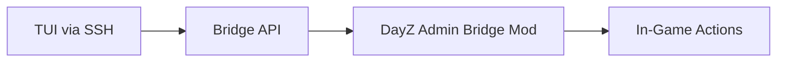

# Player Admin - Future Mod Bridge Extension

> [!IMPORTANT]
> This document contains features that **require a custom DayZ mod** to bridge external commands to in-game actions.
> These features are NOT implementable via standard RCON and require future mod development.

## 1) Overview

**Status**: Deferred - Pending custom mod development  
**Dependency**: Custom "Admin Bridge" mod (similar to CFTools GameLabs)  
**Reference**: See [players-admin-menu.md](./players-admin-menu.md) for SSH-accessible features

---

## 2) How It Would Work



**Mechanism** (based on CFTools GameLabs research):
1. Custom mod runs on DayZ server
2. Mod reads command queue from file or listens on socket
3. External tool (TUI) writes commands to queue
4. Mod executes in-game: teleport, spawn, heal, kill

---

## 3) Features to Implement

### 3.1) Kill Player

**UI Design**: See [players-admin-menu.md](./players-admin-menu.md#37-kill-player-dialog)

**Mod Implementation**:
```csharp
// Enforce script pseudocode
void KillPlayer(string playerId) {
    PlayerBase player = GetPlayerById(playerId);
    if (player) {
        player.SetHealth(0);
    }
}
```

---

### 3.2) Heal Player

**UI Design**: See [players-admin-menu.md](./players-admin-menu.md#38-heal-menu)

**Mod Implementation**:
```csharp
void HealPlayer(string playerId, string stat) {
    PlayerBase player = GetPlayerById(playerId);
    if (!player) return;
    
    switch(stat) {
        case "health": player.SetHealth(5000); break;
        case "blood": player.SetBlood(5000); break;
        case "all":
            player.SetHealth(5000);
            player.SetBlood(5000);
            // etc.
            break;
    }
}
```

---

### 3.3) Teleport Player

**UI Design**: See [players-admin-menu.md](./players-admin-menu.md#39-teleport-menu)

**Mod Implementation**:
```csharp
void TeleportPlayer(string playerId, float x, float y, float z) {
    PlayerBase player = GetPlayerById(playerId);
    if (player) {
        player.SetPosition(Vector(x, y, z));
    }
}

void TeleportToPlayer(string sourceId, string targetId) {
    PlayerBase source = GetPlayerById(sourceId);
    PlayerBase target = GetPlayerById(targetId);
    if (source && target) {
        source.SetPosition(target.GetPosition());
    }
}
```

---

### 3.4) Spawn Item at Player

**UI Design**: See [players-admin-menu.md](./players-admin-menu.md#310-spawn-item-menu)

**Mod Implementation**:
```csharp
void SpawnItemAtPlayer(string playerId, string className, int amount) {
    PlayerBase player = GetPlayerById(playerId);
    if (!player) return;
    
    vector pos = player.GetPosition();
    for (int i = 0; i < amount; i++) {
        GetGame().CreateObject(className, pos, false);
    }
}
```

---

## 4) Bridge Communication Options

| Method | Pros | Cons |
|--------|------|------|
| **File-based queue** | Simple, no network | Polling delay, file I/O |
| **TCP/UDP socket** | Real-time | Firewall config, complexity |
| **HTTP REST API** | Standard, debuggable | Needs embedded server |
| **RCON extension** | Uses existing infra | Harder to implement |

**Recommended**: File-based queue for simplicity

```
/data/state/admin_bridge/
├── commands.json        # Commands to execute
├── results.json         # Execution results
└── status.json          # Mod health check
```

---

## 5) Development Roadmap

| Step | Task | Complexity |
|------|------|------------|
| 1 | Research DayZ Enforce scripting | High |
| 2 | Create minimal mod skeleton | Medium |
| 3 | Implement file-based command queue | Medium |
| 4 | Add Kill/Heal/Teleport/Spawn handlers | Medium |
| 5 | Integrate with TUI players.sh | Low |
| 6 | Testing and error handling | High |

**Estimated effort**: 40-80 hours of DayZ mod development

---

## 6) Alternative: CFTools Cloud Integration

If custom mod development is not feasible:

**CFTools Cloud** offers these features via their GameLabs mod:
- Requires CFTools Cloud subscription
- Install GameLabs mod on server
- Configure `gamelabs.cfg` with API credentials
- Use CFTools API for commands

**API Docs**: https://developer.cftools.cloud/
