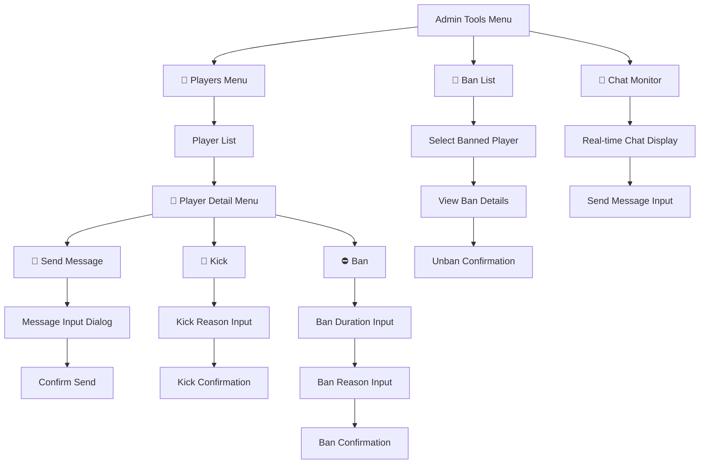

# Players Admin Menu - Implementation Plan

## 1) Overview

**Title:** Players Submenu in Admin Tools  
**Scope:** Player management via SSH/RCON (no in-game access required)  
**Objective:** TUI interface for player oversight and admin actions via SSH  
**Why:** Admins need remote management when away from PC

> [!NOTE]
> Features requiring in-game admin mods (Kill, Heal, Teleport, Spawn) are documented in:
> [players-admin-menu-mod-extension.md](./players-admin-menu-mod-extension.md)

---

## 2) Navigation Flow



---

## 3) UI Mockups By Screen

### 3.1) Admin Tools Menu (Entry Point)

**Function:** `admin_tools_menu()` in `admin_config.sh`  
**Navigation:** Main Menu → Server Settings → Admin Tools

```
┌─────────────────────────────────────────────────────────┐
│                    👤 Admin Tools                       │
├─────────────────────────────────────────────────────────┤
│  👥|Players                                             │
│  🚫|Ban List                                            │
│  �|Chat Monitor                                        │
│  ────────────────────                                   │
│  �🔑|Passwords                                           │
│  ────────────────────                                   │
│  ←|Back                                                 │
└─────────────────────────────────────────────────────────┘
```

**Behavior:**
- Arrow keys to navigate
- Enter to select
- "Players" calls `players_menu()`

---

### 3.2) Players Menu (Player List)

**Function:** `players_menu()` in `lib/players.sh`  
**Navigation:** Admin Tools → Players

```
┌───────────────────────────────────────────────────────────────────────────┐
│                              👥 Players                                   │
│                           Online: 3 / 32                                  │
├─────────────────┬──────────┬─────────────┬────────────┬───────────────────┤
│  Name           │  Ping    │  Session ID │  Online    │  Sessions         │
├─────────────────┼──────────┼─────────────┼────────────┼───────────────────┤
│  👤 Gaukh       │  45 ms   │  #0         │  1h 23m    │  12               │
│  👤 Max         │  120 ms  │  #1         │  0h 45m    │  3                │
│  👤 Tobi        │  78 ms   │  #2         │  2h 10m    │  47               │
├─────────────────┴──────────┴─────────────┴────────────┴───────────────────┤
│  🔄|Refresh                                                               │
│  ────────────────────                                                     │
│  ←|Back                                                                   │
└───────────────────────────────────────────────────────────────────────────┘
```

**Column Explanations:**
| Column | Description |
|--------|-------------|
| Name | In-game player name with 👤 prefix |
| Ping | Network latency in milliseconds |
| Session ID | RCON player ID (#0, #1...) for commands |
| Online | Duration since player connected this session |
| Sessions | Total session count (joins >2min counted) |

**Data Flow:**
```bash
players_menu() {
    local inst_dir="$1"
    local max_players=$(get_max_players "$inst_dir")
    
    while true; do
        # Fetch fresh data from RCON
        local player_json=$(fetch_online_players "$inst_dir")
        local player_count=$(echo "$player_json" | jq '.count')
        
        # Build menu items array
        local -a items=()
        # Parse JSON, add each player as menu item
        # "👤|Name|Ping|#ID"
        
        items+=("🔄|Refresh")
        items+=("--------------------")
        items+=("←|Back")
        
        # Display with custom header showing count
        draw_players_header "$player_count" "$max_players"
        
        if run_menu items "Players"; then
            # Handle selection
            case "${items[$MENU_RESULT]}" in
                "🔄|Refresh") continue ;;
                "←|Back") return ;;
                👤*) 
                    # Extract player data, open detail menu
                    player_details_menu "$inst_dir" "$player_data"
                    ;;
            esac
        fi
    done
}
```

**Error States:**
```
┌─────────────────────────────────────────────────────────┐
│                     👥 Players                          │
│                                                         │
│          ⚠️ Server is not running                       │
│          Start the server to view players               │
│                                                         │
│  ←|Back                                                 │
└─────────────────────────────────────────────────────────┘
```

```
┌─────────────────────────────────────────────────────────┐
│                     👥 Players                          │
│                  Online: 0 / 32                         │
│                                                         │
│          No players currently online                    │
│                                                         │
│  🔄|Refresh                                             │
│  ←|Back                                                 │
└─────────────────────────────────────────────────────────┘
```

---

### 3.3) Player Detail Menu

**Function:** `player_details_menu()` in `lib/players.sh`  
**Navigation:** Players → [Select Player]

```
┌─────────────────────────────────────────────────────────┐
│                  👤 Gaukh                               │
│          Player #0  │  Ping: 45 ms                      │
│          GUID: 1a2b3c4d...                              │
├─────────────────────────────────────────────────────────┤
│  💬|Send Message                                        │
│  👢|Kick                                                │
│  ⛔|Ban                                                 │
│  ────────────────────                                   │
│  🔫|Kill                              [VPP/COT]         │
│  ❤️|Heal                              [VPP/COT]         │
│  📍|Teleport                          [VPP/COT]         │
│  📦|Spawn Item                        [VPP/COT]         │
│  ────────────────────                                   │
│  ←|Back                                                 │
└─────────────────────────────────────────────────────────┘
```

**Conditional Display (No Admin Mod):**
```
┌─────────────────────────────────────────────────────────┐
│                  👤 Gaukh                               │
│          Player #0  │  Ping: 45 ms                      │
├─────────────────────────────────────────────────────────┤
│  💬|Send Message                                        │
│  👢|Kick                                                │
│  ⛔|Ban                                                 │
│  ────────────────────                                   │
│  ←|Back                                                 │
└─────────────────────────────────────────────────────────┘
```

**Data Flow:**
```bash
player_details_menu() {
    local inst_dir="$1"
    local player_id="$2"
    local player_name="$3"
    local player_guid="$4"
    local player_ping="$5"
    
    local has_admin_mod=$(has_advanced_admin_tools "$inst_dir")
    
    while true; do
        local -a items=(
            "💬|Send Message"
            "👢|Kick"
            "⛔|Ban"
        )
        
        if [[ "$has_admin_mod" == "true" ]]; then
            items+=("--------------------")
            items+=("🔫|Kill")
            items+=("❤️|Heal")
            items+=("📍|Teleport")
            items+=("📦|Spawn Item")
        fi
        
        items+=("--------------------")
        items+=("←|Back")
        
        if run_menu items "$player_name (#$player_id)"; then
            case "${items[$MENU_RESULT]}" in
                "💬|Send Message") send_message_dialog "$inst_dir" "$player_name" ;;
                "👢|Kick") kick_player_dialog "$inst_dir" "$player_id" "$player_name" ;;
                "⛔|Ban") ban_player_dialog "$inst_dir" "$player_id" "$player_name" ;;
                "🔫|Kill") kill_player_dialog "$inst_dir" "$player_name" ;;
                "❤️|Heal") heal_menu "$inst_dir" "$player_name" ;;
                "📍|Teleport") teleport_menu "$inst_dir" "$player_name" ;;
                "📦|Spawn Item") spawn_item_menu "$inst_dir" "$player_name" ;;
                "←|Back") return ;;
            esac
        else
            return
        fi
    done
}
```

---

### 3.4) Send Message Dialog

**Function:** `send_message_dialog()` in `lib/players.sh`  
**Navigation:** Player Detail → Send Message

**Step 1: Message Input**
```
┌─────────────────────────────────────────────────────────┐
│              💬 Message to Gaukh                        │
│                                                         │
│  ℹ️ Message will be broadcast to ALL players            │
│  (Prefixed with "[Admin → Gaukh]:")                     │
│                                                         │
│  Message:                                               │
│  ┌─────────────────────────────────────────────────┐    │
│  │ Stand still, spawning bandage for you           │    │
│  └─────────────────────────────────────────────────┘    │
│                                                         │
│              [Enter] Send    [Esc] Cancel               │
└─────────────────────────────────────────────────────────┘
```

**Step 2: Result**
```
┌─────────────────────────────────────────────────────────┐
│                     ✓ Success                           │
│                                                         │
│  Message sent to server chat:                           │
│  "[Admin → Gaukh]: Stand still, spawning bandage"       │
│                                                         │
│                   [Press any key]                       │
└─────────────────────────────────────────────────────────┘
```

**Data Flow:**
```bash
send_message_dialog() {
    local inst_dir="$1"
    local player_name="$2"
    
    local message=$(read_input "Message:" "" "Message to $player_name")
    [[ -z "$message" ]] && return
    
    local formatted="[Admin → $player_name]: $message"
    local result=$(send_rcon_command "$inst_dir" "say -1 $formatted")
    
    show_message "Message sent to server chat" "Success"
}
```

---

### 3.5) Kick Player Dialog

**Function:** `kick_player_dialog()` in `lib/players.sh`  
**Navigation:** Player Detail → Kick

```
┌─────────────────────────────────────────────────────────┐
│                 👢 Kick Player                          │
│                                                         │
│  Are you sure you want to kick "Gaukh"?                 │
│                                                         │
│  This will disconnect the player immediately.           │
│  They can rejoin at any time.                           │
│                                                         │
│              [Y] Yes        [N] No                      │
│                        Default: N                       │
└─────────────────────────────────────────────────────────┘
```

**Success Result:**
```
┌─────────────────────────────────────────────────────────┐
│                     ✓ Success                           │
│                                                         │
│  Player "Gaukh" has been kicked from the server.        │
│                                                         │
│                   [Press any key]                       │
└─────────────────────────────────────────────────────────┘
```

**Data Flow:**
```bash
kick_player_dialog() {
    local inst_dir="$1"
    local player_id="$2"
    local player_name="$3"
    
    if confirm "Kick player \"$player_name\"?" "n"; then
        local result=$(send_rcon_command "$inst_dir" "#kick $player_id")
        show_message "Player \"$player_name\" kicked" "Success"
    fi
}
```

---

### 3.6) Ban Player Dialog (Two-Step)

**Function:** `ban_player_dialog()` in `lib/players.sh`  
**Navigation:** Player Detail → Ban

**Step 1: Duration Input**
```
┌─────────────────────────────────────────────────────────┐
│                  ⛔ Ban Player                          │
│                                                         │
│  Ban duration for "Gaukh":                              │
│                                                         │
│  ┌─────────────────────────────────────────────────┐    │
│  │ 7d                                              │    │
│  └─────────────────────────────────────────────────┘    │
│                                                         │
│  Examples:                                              │
│    30m = 30 minutes                                     │
│    2h  = 2 hours                                        │
│    7d  = 7 days                                         │
│    perm = permanent                                     │
│                                                         │
│              [Enter] Continue    [Esc] Cancel           │
└─────────────────────────────────────────────────────────┘
```

**Step 2: Confirmation**
```
┌─────────────────────────────────────────────────────────┐
│              ⚠️ Confirm Ban                             │
│                                                         │
│  Player: Gaukh                                          │
│  Duration: 7 days                                       │
│                                                         │
│  ⚠️ Player will be unable to rejoin for this duration   │
│                                                         │
│              [Y] Yes        [N] No                      │
│                        Default: Y                       │
└─────────────────────────────────────────────────────────┘
```

**Success Result:**
```
┌─────────────────────────────────────────────────────────┐
│                     ✓ Success                           │
│                                                         │
│  Player "Gaukh" banned for 7 days.                      │
│                                                         │
│                   [Press any key]                       │
└─────────────────────────────────────────────────────────┘
```

**Data Flow:**
```bash
ban_player_dialog() {
    local inst_dir="$1"
    local player_id="$2"
    local player_name="$3"
    
    # Step 1: Get duration
    local duration=$(read_input "Duration (30m/2h/7d/perm):" "" "Ban $player_name")
    [[ -z "$duration" ]] && return
    
    local human_duration=$(parse_duration_human "$duration")
    
    # Step 2: Confirm
    if confirm "Ban \"$player_name\" for $human_duration?" "y"; then
        local result=$(send_rcon_command "$inst_dir" "#exec ban $player_id")
        # Note: BattlEye ban is permanent; timed bans need ban.txt management
        show_message "Player \"$player_name\" banned for $human_duration" "Success"
    fi
}
```

---

### 3.7) Kill Player Dialog (Admin Mod Required)

**Function:** `kill_player_dialog()` in `lib/players.sh`  
**Navigation:** Player Detail → Kill

```
┌─────────────────────────────────────────────────────────┐
│                  🔫 Kill Player                         │
│                                                         │
│  ⚠️ Are you sure you want to kill "Gaukh"?              │
│                                                         │
│  This will immediately kill the player.                 │
│  They will respawn and lose their inventory.            │
│                                                         │
│              [Y] Yes        [N] No                      │
│                        Default: N                       │
└─────────────────────────────────────────────────────────┘
```

**Data Flow:**
```bash
kill_player_dialog() {
    local inst_dir="$1"
    local player_name="$2"
    
    if confirm "Kill player \"$player_name\"? This cannot be undone." "n"; then
        # Command depends on admin mod installed
        local admin_mod=$(detect_admin_mod "$inst_dir")
        case "$admin_mod" in
            "VPPAdminTools"|"COT")
                # These use in-game commands, not RCON
                show_message "Use in-game admin tool to kill player" "Info"
                ;;
        esac
    fi
}
```

---

### 3.8) Heal Menu (Admin Mod Required)

**Function:** `heal_menu()` in `lib/players.sh`  
**Navigation:** Player Detail → Heal

**Step 1: Stat Selection**
```
┌─────────────────────────────────────────────────────────┐
│                  ❤️ Heal Gaukh                          │
├─────────────────────────────────────────────────────────┤
│  ❤️|Health (Full)                                       │
│  🩸|Blood (Full)                                        │
│  🌡️|Temperature (37°C)                                  │
│  💧|Hydration (Full)                                    │
│  🍖|Energy (Full)                                       │
│  ────────────────────                                   │
│  ✨|Heal All (Full Stats)                               │
│  ────────────────────                                   │
│  ←|Back                                                 │
└─────────────────────────────────────────────────────────┘
```

**Step 2: Confirmation (for individual stat)**
```
┌─────────────────────────────────────────────────────────┐
│               ❤️ Restore Health                         │
│                                                         │
│  Set "Gaukh" health to maximum?                         │
│                                                         │
│              [Y] Yes        [N] No                      │
│                        Default: Y                       │
└─────────────────────────────────────────────────────────┘
```

**Data Flow:**
```bash
heal_menu() {
    local inst_dir="$1"
    local player_name="$2"
    
    local -a items=(
        "❤️|Health (Full)"
        "🩸|Blood (Full)"
        "🌡️|Temperature (37°C)"
        "💧|Hydration (Full)"
        "🍖|Energy (Full)"
        "--------------------"
        "✨|Heal All (Full Stats)"
        "--------------------"
        "←|Back"
    )
    
    if run_menu items "Heal $player_name"; then
        case "${items[$MENU_RESULT]}" in
            "❤️|Health"*) heal_stat "$inst_dir" "$player_name" "health" ;;
            "🩸|Blood"*) heal_stat "$inst_dir" "$player_name" "blood" ;;
            "🌡️|Temperature"*) heal_stat "$inst_dir" "$player_name" "temperature" ;;
            "💧|Hydration"*) heal_stat "$inst_dir" "$player_name" "water" ;;
            "🍖|Energy"*) heal_stat "$inst_dir" "$player_name" "energy" ;;
            "✨|Heal All"*) heal_stat "$inst_dir" "$player_name" "all" ;;
            "←|Back") return ;;
        esac
    fi
}
```

---

### 3.9) Teleport Menu (Admin Mod Required)

**Function:** `teleport_menu()` in `lib/players.sh`  
**Navigation:** Player Detail → Teleport

**Step 1: Teleport Type Selection**
```
┌─────────────────────────────────────────────────────────┐
│                 📍 Teleport Gaukh                       │
├─────────────────────────────────────────────────────────┤
│  🎯|To Coordinates                                      │
│  👤|To Another Player                                   │
│  ────────────────────                                   │
│  ←|Back                                                 │
└─────────────────────────────────────────────────────────┘
```

**Step 2A: Coordinates Input**
```
┌─────────────────────────────────────────────────────────┐
│            📍 Teleport to Coordinates                   │
│                                                         │
│  Enter X,Y,Z coordinates for "Gaukh":                   │
│                                                         │
│  X: ┌────────────────┐                                  │
│     │ 7500           │                                  │
│     └────────────────┘                                  │
│  Y: ┌────────────────┐                                  │
│     │ 0              │                                  │
│     └────────────────┘                                  │
│  Z: ┌────────────────┐                                  │
│     │ 7500           │                                  │
│     └────────────────┘                                  │
│                                                         │
│  ℹ️ Chernarus center: 7500, 0, 7500                     │
│                                                         │
│           [Enter] Teleport    [Esc] Cancel              │
└─────────────────────────────────────────────────────────┘
```

**Step 2B: Player Selection**
```
┌─────────────────────────────────────────────────────────┐
│           📍 Teleport Gaukh to Player                   │
├─────────────────────────────────────────────────────────┤
│  👤|Max                                                 │
│  👤|Tobi                                                │
│  ────────────────────                                   │
│  ←|Back                                                 │
└─────────────────────────────────────────────────────────┘
```

**Step 3: Confirmation**
```
┌─────────────────────────────────────────────────────────┐
│            📍 Confirm Teleport                          │
│                                                         │
│  Teleport "Gaukh" to Max's location?                    │
│  (1m offset to prevent collision)                       │
│                                                         │
│              [Y] Yes        [N] No                      │
│                        Default: Y                       │
└─────────────────────────────────────────────────────────┘
```

**Data Flow:**
```bash
teleport_menu() {
    local inst_dir="$1"
    local player_name="$2"
    
    local -a items=(
        "🎯|To Coordinates"
        "👤|To Another Player"
        "--------------------"
        "←|Back"
    )
    
    if run_menu items "Teleport $player_name"; then
        case "${items[$MENU_RESULT]}" in
            "🎯|To Coordinates")
                teleport_to_coords_dialog "$inst_dir" "$player_name"
                ;;
            "👤|To Another Player")
                teleport_to_player_dialog "$inst_dir" "$player_name"
                ;;
            "←|Back") return ;;
        esac
    fi
}

teleport_to_coords_dialog() {
    local inst_dir="$1"
    local player_name="$2"
    
    local x=$(read_input "X coordinate:" "7500" "Teleport")
    [[ -z "$x" ]] && return
    
    local y=$(read_input "Y coordinate:" "0" "Teleport")
    [[ -z "$y" ]] && return
    
    local z=$(read_input "Z coordinate:" "7500" "Teleport")
    [[ -z "$z" ]] && return
    
    if confirm "Teleport \"$player_name\" to ($x, $y, $z)?" "y"; then
        # Execute via admin mod
        show_message "Teleported \"$player_name\" to $x, $y, $z" "Success"
    fi
}

teleport_to_player_dialog() {
    local inst_dir="$1"
    local source_player="$2"
    
    # Get list of other players
    local players=$(fetch_online_players "$inst_dir")
    # Build menu excluding source player
    # ...
    
    if run_menu player_items "Select Target Player"; then
        local target_player="${player_items[$MENU_RESULT]}"
        if confirm "Teleport \"$source_player\" to $target_player?" "y"; then
            show_message "Teleported near $target_player" "Success"
        fi
    fi
}
```

---

### 3.10) Spawn Item Menu (Admin Mod Required)

**Function:** `spawn_item_menu()` in `lib/players.sh`  
**Navigation:** Player Detail → Spawn Item

**Step 1: Item Search**
```
┌─────────────────────────────────────────────────────────┐
│               📦 Spawn Item for Gaukh                   │
│                                                         │
│  Search for item:                                       │
│  ┌─────────────────────────────────────────────────┐    │
│  │ bandage                                         │    │
│  └─────────────────────────────────────────────────┘    │
│                                                         │
│           [Enter] Search    [Esc] Cancel                │
└─────────────────────────────────────────────────────────┘
```

**Step 2: Item Selection (Paginated Table View)**

> [!NOTE]
> Uses same table view component as Types Editor and Workshop Browser with pagination.
> Mod source is determined from which types.xml file contains the class.

```
┌────────────────────────────────────────────────────────────────────────────────────────────────────┐
│                                    📦 Item Search Results                                          │
│                           Query: "bandage"  │  42 results  │  Page 1/3                             │
├──────────────────────────┬────────────────┬─────────────────────────┬──────────────────────────────┤
│  Class Name              │  Category      │  Mod                    │  Stackable                   │
├──────────────────────────┼────────────────┼─────────────────────────┼──────────────────────────────┤
│  BandageDressing         │  Medical       │  Vanilla                │  No                          │
│  BandageDressing_Clean   │  Medical       │  Vanilla                │  No                          │
│  Rag                     │  Medical       │  Vanilla                │  Yes                         │
│  ExpansionBandage        │  Medical       │  DayZ Expansion         │  No                          │
│  MuchStuffMedical_Band   │  Medical       │  MuchStuffPack          │  Yes                         │
│  ...                     │  ...           │  ...                    │  ...                         │
├──────────────────────────┴────────────────┴─────────────────────────┴──────────────────────────────┤
│  [←/→] Page    [↑/↓] Select    [/] Search    [F] Filter Category    [Enter] Select    [Esc] Back   │
└────────────────────────────────────────────────────────────────────────────────────────────────────┘
```

**Table Columns:**
| Column | Description |
|--------|-------------|
| Class Name | Item class name for spawning |
| Category | Item category (Medical, Weapons, Food, etc.) - filterable |
| Mod | Source mod name (Vanilla, Expansion, etc.) from types.xml path |
| Stackable | Yes if quantmin/quantmax ≠ -1 in types.xml, No otherwise |

**Keyboard Shortcuts:**
| Key | Action |
|-----|--------|
| ←/→ | Navigate pages |
| ↑/↓ | Select item |
| / | New search |
| F | Filter by category |
| Enter | Select item |
| Esc | Back |

**Step 3: Amount Input**
```
┌─────────────────────────────────────────────────────────┐
│               📦 Spawn BandageDressing                  │
│                                                         │
│  How many to spawn?                                     │
│  ┌─────────────────────────────────────────────────┐    │
│  │ 5                                               │    │
│  └─────────────────────────────────────────────────┘    │
│                                                         │
│  ℹ️ Max stack size: 10                                  │
│                                                         │
│           [Enter] Continue    [Esc] Cancel              │
└─────────────────────────────────────────────────────────┘
```

**Step 4: Confirmation**
```
┌─────────────────────────────────────────────────────────┐
│              📦 Confirm Spawn                           │
│                                                         │
│  Spawn 5x BandageDressing at Gaukh's location?          │
│                                                         │
│              [Y] Yes        [N] No                      │
│                        Default: Y                       │
└─────────────────────────────────────────────────────────┘
```

**Data Flow:**
```bash
spawn_item_menu() {
    local inst_dir="$1"
    local player_name="$2"
    
    while true; do
        # Step 1: Search
        local search=$(read_input "Search item:" "" "Spawn Item")
        [[ -z "$search" ]] && return
        
        # Search in types.xml (reuses existing search from types.sh)
        local results=$(search_types_xml "$inst_dir" "$search")
        local result_count=$(echo "$results" | wc -l)
        
        if [[ -z "$results" ]]; then
            show_message "No items found for \"$search\"" "Info"
            continue
        fi
        
        # Step 2: Paginated table view (reuses table component)
        local page=1
        local page_size=15
        
        while true; do
            # Draw table with current page
            local offset=$(( (page - 1) * page_size ))
            local page_items=$(echo "$results" | tail -n +$((offset + 1)) | head -n $page_size)
            local total_pages=$(( (result_count + page_size - 1) / page_size ))
            
            draw_item_table "$page_items" "$search" "$result_count" "$page" "$total_pages"
            
            read -n 1 key
            case "$key" in
                $'\e[D') # Left arrow - prev page
                    [[ $page -gt 1 ]] && ((page--))
                    ;;
                $'\e[C') # Right arrow - next page
                    [[ $page -lt $total_pages ]] && ((page++))
                    ;;
                '/') # New search
                    break
                    ;;
                '') # Enter - select highlighted
                    local selected_item="${highlighted_row}"
                    
                    # Step 3: Amount
                    local amount=$(read_input "Amount:" "1" "Spawn $selected_item")
                    [[ -z "$amount" ]] && continue
                    
                    # Step 4: Confirm
                    if confirm "Spawn ${amount}x $selected_item at $player_name?" "y"; then
                        spawn_item_at_player "$inst_dir" "$player_name" "$selected_item" "$amount"
                        show_message "Spawned ${amount}x $selected_item" "Success"
                        return
                    fi
                    ;;
                $'\e') # Escape - back
                    return
                    ;;
            esac
        done
    done
}
        if run_menu items "Search Results"; then
            case "${items[$MENU_RESULT]}" in
                "📦|"*)
                    local item_name="${items[$MENU_RESULT]#📦|}"
                    
                    # Step 3: Amount
                    local amount=$(read_input "Amount:" "1" "Spawn $item_name")
                    [[ -z "$amount" ]] && continue
                    
                    # Step 4: Confirm
                    if confirm "Spawn ${amount}x $item_name at $player_name?" "y"; then
                        spawn_item_at_player "$inst_dir" "$player_name" "$item_name" "$amount"
                        show_message "Spawned ${amount}x $item_name" "Success"
                        return
                    fi
                    ;;
                "🔍|New Search") continue ;;
                "←|Back") return ;;
            esac
        else
            return
        fi
    done
}
```

---

## 4) Data Sources

### Max Players
```bash
get_max_players() {
    local inst_dir="$1"
    local config_file="${inst_dir}/data/config/serverDZ.cfg"
    grep -oP 'maxPlayers\s*=\s*\K[0-9]+' "$config_file"
}
```

### Online Players (RCON)
```bash
fetch_online_players() {
    local inst_dir="$1"
    # Returns JSON from be_rcon.py --action players
    run_rcon_json "$inst_dir" "players"
}
```

### Admin Mod Detection
```bash
has_advanced_admin_tools() {
    local inst_dir="$1"
    # Check if VPP, COT, or ZomBerry is installed
    for mod_id in "1828439124" "1564026768" "1582756848"; do
        if is_admin_tool_installed "$mod_id" "$inst_dir"; then
            echo "true"
            return
        fi
    done
    echo "false"
}
```

---

## 5) Implementation Order

| Step | Component | Function | Phase |
|------|-----------|----------|-------|
| 1 | Backend | Extend `be_rcon.py` with JSON actions | 1 |
| 2 | Frontend | Create `lib/players.sh` skeleton | 1 |
| 3 | Frontend | `get_max_players()` | 1 |
| 4 | Frontend | `fetch_online_players()` | 1 |
| 5 | Frontend | `players_menu()` | 1 |
| 6 | Frontend | `player_details_menu()` | 1 |
| 7 | Frontend | `send_message_dialog()` | 1 |
| 8 | Frontend | `kick_player_dialog()` with reason | 1 |
| 9 | Frontend | `ban_player_dialog()` with reason | 1 |
| 10 | Frontend | Ban data persistence (JSON) | 1 |
| 11 | Frontend | `ban_list_menu()` | 1 |
| 12 | Frontend | `unban_player_dialog()` | 1 |
| 13 | Integration | Add to `admin_config.sh` | 1 |
| 14 | Phase 2 | Session tracking system | 2 |
| 15 | Phase 2 | `chat_monitor()` | 2 |
| 16 | Phase 2 | Admin action logging | 2 |

---

## 6) Phase Summary

| Phase | Features | SSH? |
|-------|----------|------|
| **Phase 1** | Player list, kick, ban (with reason), message, ban list, unban | ✅ |
| **Phase 2** | Session tracking, chat monitoring, admin logs | ✅ |
| **Future** | Kill, Heal, Teleport, Spawn → See [mod extension](./players-admin-menu-mod-extension.md) | ❌ |

---

## 6.1) Feasibility Verification (Research Complete)

> [!NOTE]
> Every feature has been researched and verified. This section documents findings.

### ✅ VERIFIED: RCON Players Command

**Format**: `#[ID] [Name] [GUID] ([Ping] ms)`
```
#0  Gaukh  abc123def456789  (45 ms)
#1  Max  def456abc789123  (120 ms)
```

**Fields available**: Player ID, Name, BattlEye GUID, Ping
**Parsing**: Already have `be_rcon.py` that can send commands and receive responses

---

### ✅ VERIFIED: maxPlayers from serverDZ.cfg

**Location**: `lib/config.sh` line 98
```bash
["maxPlayers"]="60"  # Default value
```
**Parsing**: Already defined in `SERVERDZ_DEFAULTS` with validation `int:1-127`
**Access**: Can read from `${inst_dir}/data/config/serverDZ.cfg`

---

### ✅ VERIFIED: Kick Command

**Syntax**: `kick [ID]` or `#kick [ID]`
**Source**: Research confirmed, uses player ID from `players` command
**Implementation**: Send via existing `be_rcon.py`

---

### ✅ VERIFIED: Ban Command & bans.txt

**RCON Syntax**: `#exec ban [ID]` - executes permanent ban
**File Location**: `BattlEye/bans.txt` in server profile
**File Format**: `GUID time (Reason)`
- `time = -1` means permanent
- `time > 0` is duration in **minutes** (not hours as some docs say)

**Example**:
```
abc123def456 -1 (Cheating - aimbot)
def789ghi012 1440 (Temp ban - chat spam)
```

> [!WARNING]
> **Timed bans**: RCON `#exec ban` only does permanent. For timed bans, we must:
> 1. Kick the player via RCON
> 2. Add entry to bans.txt manually with duration
> 3. Reload bans via `#exec loadBans`

---

### ✅ VERIFIED: Unban Command

**RCON Syntax**: `#exec unban [GUID]`
**Alternative**: Remove line from bans.txt, then `#exec loadBans`
**Implementation**: Both approaches work

---

### ✅ VERIFIED: Say Command (Send Message)

**Syntax**: `say -1 [message]` - broadcasts to all players
**Note**: `-1` means global, specific player ID for private (but private may not work in DayZ)
**Implementation**: Already works via `be_rcon.py`

---

### ✅ VERIFIED: Chat Monitoring

**Protocol**: BattlEye RCON message type `0x02` delivers server messages including chat
**Requirement**: Maintain persistent RCON connection, listen for incoming packets
**Implementation**: Extend `be_rcon.py` to run in listen mode

```python
# Already in be_rcon.py line 130-135:
elif msg_type == BE_MESSAGE:
    # Server message/Chat
    text = data[9:].decode('utf-8', errors='ignore')
```

**Status**: ✅ Protocol support exists, need to expose it

---

### ⚠️ PARTIAL: Session Tracking (Join/Leave Events)

**Research Finding**: RCON does NOT provide native join/leave notifications
**Solution**: Poll `players` command periodically (every 30s)
- Compare current list with previous
- Detect new players (join) and missing players (leave)
- Store timestamps in JSON files

**Implementation**:
```bash
# Daemon/cron approach
while true; do
    fetch_players > /tmp/current_players.json
    diff_and_update_sessions
    sleep 30
done
```

**Status**: ✅ Feasible via polling, not real-time events

---

### ✅ VERIFIED: types.xml Parsing for Item Spawn

**Existing Code**: `lib/xml_parser.py` has full types.xml parsing
**Query Function**: `query()` returns JSON with:
- `name` (class name)
- `category` (from `<category name="...">`)
- `nominal`, `min`, `lifetime`, `restock`

**Category Tag**: `<category name="weapons"/>` - already parsed at line 305
**Stackable**: Check `quantmin`/`quantmax` - if `-1`, not stackable

**Mod Detection**: Determine from file path (vanilla vs mod folder)
```python
# /mpmissions/dayzOffline.chernarusplus/db/types.xml → Vanilla
# /steamapps/workshop/.../CustomCE/types_expansion.xml → Mod
```

**Status**: ✅ All data available, just need to add mod source tracking

---

### ❌ NOT FEASIBLE: Kill/Heal/Teleport/Spawn via SSH

**Research Confirmed**: VPP, COT, ZomBerry are ALL in-game GUI only
**No RCON Commands**: These mods do not expose any RCON interface
**Alternative**: CFTools Cloud API (paid external service)

**Status**: ❌ Cannot implement for SSH. Remove from Phase 1-2, mark as "requires in-game access"

---

### Summary Table

| Feature | Verified? | Method | Notes |
|---------|-----------|--------|-------|
| Player List | ✅ | RCON `players` | Parse output |
| Max Players | ✅ | serverDZ.cfg | Already in config.sh |
| Kick | ✅ | RCON `kick [ID]` | Works |
| Ban (permanent) | ✅ | RCON `#exec ban` | Works |
| Ban (timed) | ⚠️ | bans.txt + loadBans | Need file write |
| Unban | ✅ | RCON `#exec unban` | Works |
| Send Message | ✅ | RCON `say -1` | Works |
| Chat Monitor | ✅ | RCON msg type 0x02 | Need listen mode |
| Session Tracking | ⚠️ | Polling players | Not real-time |
| Ban List | ✅ | Parse bans.txt | File read/write |
| Item Search | ✅ | xml_parser.py | Category exists |
| Item Stackable | ✅ | quantmin/quantmax | Check for -1 |
| Item Mod Source | ✅ | File path | Parse path |
| Kill | ❌ | N/A | In-game only |
| Heal | ❌ | N/A | In-game only |
| Teleport | ❌ | N/A | In-game only |
| Spawn Item | ❌ | N/A | In-game only |

## 7) Critical Constraint: SSH-Only Access

> [!IMPORTANT]
> **Primary use case**: Admin is away from PC and connects via SSH to manage server.
> In-game admin tools (VPP, COT, Zomberry) are NOT usable via SSH.

### Research Findings: Admin Mod RCON Support

| Mod | RCON Commands? | SSH Accessible? | Notes |
|-----|---------------|-----------------|-------|
| **VPPAdminTools** | ❌ No | ❌ No | In-game GUI only |
| **Community Online Tools** | ❌ No | ❌ No | In-game GUI only |
| **ZomBerry** | ❌ No | ❌ No | In-game GUI only |
| **CFTools Cloud** | ✅ Yes | ✅ Yes | External API service |

**Conclusion**: Kill, Heal, Teleport, and Spawn Item features **cannot be implemented for SSH access** without:
1. Using CFTools Cloud external API (paid service)
2. Creating a custom DayZ mod that exposes RCON commands (complex)

### What IS Available via SSH (Standard RCON)

| Action | Command | SSH? |
|--------|---------|------|
| List players | `players` | ✅ |
| Kick player | `#kick <id>` | ✅ |
| Ban player | `#exec ban <id>` | ✅ |
| Unban player | `#exec unban <id>` | ✅ |
| Send message | `say -1 <message>` | ✅ |
| Lock server | `#lock` | ✅ |
| Unlock server | `#unlock` | ✅ |
| Restart | `#restart` | ✅ |
| Shutdown | `#shutdown` | ✅ |
| **Teleport** | ❌ N/A | ❌ |
| **Spawn item** | ❌ N/A | ❌ |
| **Kill player** | ❌ N/A | ❌ |
| **Heal player** | ❌ N/A | ❌ |

---

## 8) New UI: Ban List Menu

**Function:** `ban_list_menu()` in `lib/players.sh`  
**Navigation:** Admin Tools → Ban List

### 3.11) Ban List View

```
┌───────────────────────────────────────────────────────────────────────────────────────┐
│                                    🚫 Ban List                                        │
│                                   5 banned players                                    │
├──────────────────┬──────────────────┬───────────────────┬────────────┬────────────────┤
│  Player Name     │  Steam Name      │  Steam64 ID       │  Duration  │  Reason        │
├──────────────────┼──────────────────┼───────────────────┼────────────┼────────────────┤
│  BadPlayer123    │  xXBadGuyXx      │  7656119...5678   │  7 days    │  Cheating      │
│  Griefer99       │  TrollMaster     │  7656119...1234   │  Permanent │  Base griefing │
│  Spammer         │  ChatSpam        │  7656119...9999   │  1 day     │  Chat spam     │
├──────────────────┴──────────────────┴───────────────────┴────────────┴────────────────┤
│  🔄|Refresh                                                                           │
│  ────────────────────                                                                 │
│  ←|Back                                                                               │
└───────────────────────────────────────────────────────────────────────────────────────┘
```

### 3.12) Ban Details / Unban Dialog

**Navigation:** Ban List → [Select Player]

```
┌─────────────────────────────────────────────────────────┐
│                  🚫 Ban Details                         │
│                                                         │
│  Player Name:   BadPlayer123                            │
│  Steam Name:    xXBadGuyXx                              │
│  Steam64 ID:    76561198012345678                       │
│  BattlEye GUID: abc123def456...                         │
│  ────────────────────                                   │
│  Banned:        2026-01-02 14:30                        │
│  Duration:      7 days                                  │
│  Expires:       2026-01-09 14:30                        │
│  Reason:        Cheating - aimbot suspected             │
│  ────────────────────                                   │
│  Banned by:     Admin (via TUI)                         │
├─────────────────────────────────────────────────────────┤
│  🔓|Unban Player                                        │
│  ────────────────────                                   │
│  ←|Back                                                 │
└─────────────────────────────────────────────────────────┘
```

**Unban Confirmation:**
```
┌─────────────────────────────────────────────────────────┐
│              🔓 Unban Player                            │
│                                                         │
│  Remove ban for "BadPlayer123"?                         │
│                                                         │
│  They will be able to rejoin immediately.               │
│                                                         │
│              [Y] Yes        [N] No                      │
│                        Default: N                       │
└─────────────────────────────────────────────────────────┘
```

---

## 9) Updated Ban Dialog (With Reason)

**Step 2: Reason Input** (NEW - after duration)
```
┌─────────────────────────────────────────────────────────┐
│                  ⛔ Ban Reason                          │
│                                                         │
│  Enter reason for banning "Gaukh":                      │
│                                                         │
│  ┌─────────────────────────────────────────────────┐    │
│  │ Cheating - suspected aimbot                     │    │
│  └─────────────────────────────────────────────────┘    │
│                                                         │
│  (This will be logged and shown in Ban List)            │
│                                                         │
│              [Enter] Continue    [Esc] Cancel           │
└─────────────────────────────────────────────────────────┘
```

---

## 10) Chat Monitor (Real-Time)

> [!CAUTION]
> **Limitation**: Chat monitoring requires continuous RCON polling.
> BattlEye RCON provides chat via message type 0x02, but this requires
> maintaining an open connection and processing server messages in real-time.

### 3.13) Chat Monitor View

**Function:** `chat_monitor()` in `lib/players.sh`  
**Navigation:** Admin Tools → Chat Monitor

```
┌─────────────────────────────────────────────────────────────────────────┐
│                          💬 Chat Monitor                                │
│                       Server: DayZ Server 1                             │
├─────────────────────────────────────────────────────────────────────────┤
│  [12:05:32] Gaukh: Hey everyone!                                        │
│  [12:05:45] Max: Hello Gaukh                                            │
│  [12:06:12] Tobi: Anyone at NWAF?                                       │
│  [12:06:30] ★ Gaukh: Can someone help? I'm stuck                        │  ← Highlighted
│  [12:07:01] [Admin → Gaukh]: Stand still, checking your location        │
│  [12:07:15] Gaukh: Thanks!                                              │
├─────────────────────────────────────────────────────────────────────────┤
│  Message: [____________________________________]                        │
│                                                                         │
│  [Enter] Send    [Tab] Toggle highlight player    [Esc] Exit            │
└─────────────────────────────────────────────────────────────────────────┘
```

**Implementation Approach:**
```bash
chat_monitor() {
    local inst_dir="$1"
    local highlight_player=""
    
    # Start continuous RCON connection in background
    start_rcon_listener "$inst_dir" &
    local listener_pid=$!
    
    while true; do
        # Read latest messages from listener
        local messages=$(get_latest_chat_messages)
        
        # Draw chat window with highlighting
        draw_chat_window "$messages" "$highlight_player"
        
        # Handle input (non-blocking)
        read -t 0.5 -n 1 key
        case "$key" in
            $'\t') select_highlight_player ;;
            $'\n') send_chat_message ;;
            $'\e') break ;;
        esac
    done
    
    kill $listener_pid
}
```

---

## 11) Session Tracking System

### Data Storage

Session data stored in: `${inst_dir}/data/state/player_sessions/`

**File structure:**
```
player_sessions/
├── index.json                    # Quick lookup: GUID → player data
├── 76561198012345678.json        # Per-player session history
└── active_sessions.json          # Currently online players
```

**Player Session File Format:**
```json
{
  "steam64_id": "76561198012345678",
  "guid": "abc123...",
  "names": ["Gaukh", "OldName"],
  "first_seen": "2025-12-01T10:00:00Z",
  "sessions": [
    {
      "start": "2026-01-03T10:00:00Z",
      "end": "2026-01-03T12:30:00Z",
      "duration_minutes": 150
    },
    {
      "start": "2026-01-03T14:00:00Z",
      "end": null,
      "duration_minutes": null
    }
  ],
  "total_sessions": 12,
  "total_playtime_minutes": 1847
}
```

### Session Rules

| Rule | Value | Reason |
|------|-------|--------|
| Minimum session duration | 2 minutes | Ignore crash/reconnect cycles |
| Session timeout | 5 minutes | If RCON shows disconnect, wait before closing session |
| Name tracking | Keep history | Players may change names |

### Session Tracking Implementation

```bash
# Called periodically (e.g., every 30 seconds)
update_player_sessions() {
    local inst_dir="$1"
    local state_dir="${inst_dir}/data/state/player_sessions"
    
    # Get current online players from RCON
    local online=$(fetch_online_players "$inst_dir")
    
    # Compare with active_sessions.json
    # - New players: start new session
    # - Missing players: check timeout, close session if >5min
    # - Existing players: update duration
    
    # Only count session if duration >= 2 minutes
}
```

---

## 12) Item Search Integration

> [!NOTE]
> Item search for Spawn Item uses the **same types.xml search** as the existing Loot Economy editor.

**Reuses:** `search_types_xml()` from `lib/types.sh`

**Search capabilities:**
- Search by item class name (case-insensitive)
- Fuzzy matching on partial names
- Returns list of matching items with their nominal/min values

```bash
# Example usage in spawn_item_menu
search_items() {
    local inst_dir="$1"
    local query="$2"
    
    # Reuse existing types.xml search
    local types_xml=$(find_types_xml "$inst_dir")
    grep -i "$query" "$types_xml" | extract_type_names
}
```

---

## 13) Missing Features Analysis

After thorough review, here are additional features that could be valuable:

### High Priority (Add to Phase 1)

| Feature | Description | SSH? |
|---------|-------------|------|
| **Kick reason** | Add reason input before kick confirmation | ✅ |
| **Ban history log** | Track who banned whom and when | ✅ |
| **Admin action log** | Audit trail of all admin actions | ✅ |

### Medium Priority (Phase 2)

| Feature | Description | SSH? |
|---------|-------------|------|
| **Whitelist management** | Add/remove from whitelist.txt | ✅ |
| **Priority list** | Manage priority queue slots | ✅ |
| **Player notes** | Add admin notes about players | ✅ |
| **Warning system** | Warn player before kick/ban | ✅ |

### Low Priority (Future)

| Feature | Description | SSH? |
|---------|-------------|------|
| **Player stats** | Kills, deaths, playtime (requires logging) | ✅ |
| **VIP management** | Special player tiers | ✅ |
| **Scheduled bans** | Auto-unban at specific time | ✅ |
| **Ban import/export** | Share ban lists between servers | ✅ |

### NOT Possible via SSH

| Feature | Requires |
|---------|----------|
| Teleport player | In-game admin mod |
| Spawn items | In-game admin mod |
| Kill player | In-game admin mod |
| Heal player | In-game admin mod |
| View player position | CFTools Cloud API |
| View player inventory | CFTools Cloud API |

---

## 14) Final Implementation Order

| Step | Feature | SSH? | Phase |
|------|---------|------|-------|
| 1 | Extend `be_rcon.py` with JSON output | ✅ | 1 |
| 2 | Create `lib/players.sh` skeleton | ✅ | 1 |
| 3 | `get_max_players()` | ✅ | 1 |
| 4 | `fetch_online_players()` | ✅ | 1 |
| 5 | `players_menu()` with enhanced columns | ✅ | 1 |
| 6 | `player_details_menu()` | ✅ | 1 |
| 7 | `send_message_dialog()` | ✅ | 1 |
| 8 | `kick_player_dialog()` with reason | ✅ | 1 |
| 9 | `ban_player_dialog()` with reason | ✅ | 1 |
| 10 | Ban data persistence (JSON) | ✅ | 1 |
| 11 | `ban_list_menu()` | ✅ | 1 |
| 12 | `unban_player_dialog()` | ✅ | 1 |
| 13 | Session tracking system | ✅ | 2 |
| 14 | `chat_monitor()` | ✅ | 2 |
| 15 | Admin action logging | ✅ | 2 |
| 16 | ⚠️ Kill/Heal/Teleport/Spawn | ❌ | 3* |

> [!WARNING]
> *Phase 3 features (Kill, Heal, Teleport, Spawn) are **NOT implementable via SSH**.
> They require either CFTools Cloud integration or a custom DayZ mod.
> These should be deferred or removed from scope.
